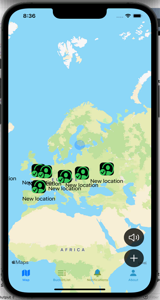
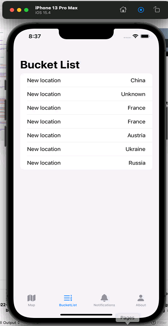
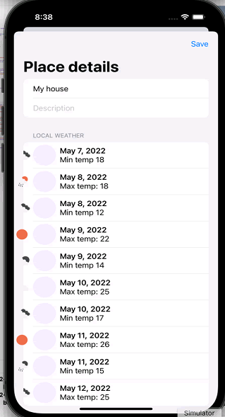
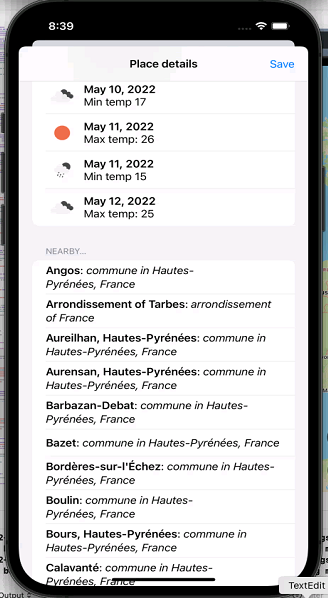
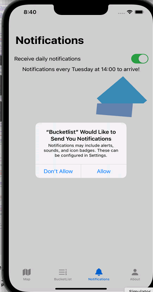
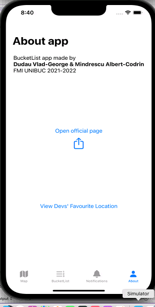

# BucketList

### SwiftUI app for iOS

© Dudau Vlad-George &  Mindrescu Albert-Codrin
@ FMI Gr. 332

### Features

- Codable implementation and usage of three web requests for getting weather data, nearby locations data and country componency of a place
- Video streaming an online fetched video for About viewpage
- UITableView equivalent in SwiftUI for weather display
- UITabViewController equivalent in SwiftUI for main ContentView() tabmenu
- UIActivityViewController equivalent in SwiftUI for implementing share button of link to our github repo
- Local notifications to remind user to check out app often
- Apple Maps and usage of overlays and pins
- Existence of three complex animations implemented by transitions and animations in SwiftUI equivalent to UIView.animate
- UI looks good on landscape mode
- WebKit equivalent for implementing browser to our github repo

### Screenshots

